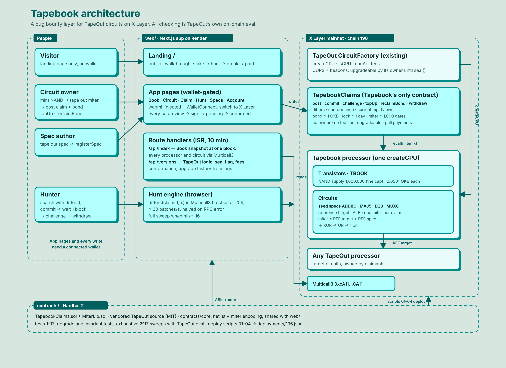

# Tapebook

The bug bounty layer for [TapeOut](https://github.com/davieslennox0/nandout) circuits on X Layer.



A **claim** says "circuit `(cpu, id)` behaves exactly like spec `S` on every input", and is backed by a bond. Anyone who finds a single input where the circuit and the spec disagree breaks the claim and takes the bond. Checking is done entirely through TapeOut's own on-chain `eval`: no owner, no admin, no upgrades, no fee, pull payments only.

**Processor:** 1,000,000 transistors (hard cap), 0.0001 OKB per transistor. Tapebook launches no token and has no trading component.

## Deployed on X Layer mainnet (chainId 196)

| Contract | Address |
| --- | --- |
| Tapebook processor (TapeOut Circuits, ERC-721) | [`0x20CEC0Ca666B43e0CbCDBb50b0b6fdf6F2D7Dd13`](https://www.oklink.com/xlayer/address/0x20CEC0Ca666B43e0CbCDBb50b0b6fdf6F2D7Dd13) |
| Tapebook Transistors (TBOOK, ERC-1155) | [`0x3F35dc7C698bAE36F32ae83bABAEce7e3BF2D039`](https://www.oklink.com/xlayer/address/0x3F35dc7C698bAE36F32ae83bABAEce7e3BF2D039) |
| TapebookClaims | [`0xF225AEc83B2738b791b3CD76006e248814bE55F0`](https://www.oklink.com/xlayer/address/0xF225AEc83B2738b791b3CD76006e248814bE55F0) |
| TapeOut CircuitFactory (upstream) | [`0x1f09daefa827f02cbb40967cc91b259763760761`](https://www.oklink.com/xlayer/address/0x1f09daefa827f02cbb40967cc91b259763760761) |

Seeded at launch: specs ADD8C (#1), MAJ5 (#2), EQ8 (#3), MUX8 (#4); targets A (#5) and B (#6); miters #7 and #8. Claim 1 (Target A vs ADD8C, 0.01 OKB bond, 30-day lock) and claim 2 (Target B vs ADD8C, 0.002 OKB bond, 1-day lock; Target B carries a planted fault). Every address and tx hash is in `contracts/deployments/196.json`. The web app defaults to these addresses; the `NEXT_PUBLIC_*` variables below override them.

## Layout

| Path | What it is |
| --- | --- |
| `contracts/contracts/TapebookClaims.sol` | Bonded, breakable claims. The only contract Tapebook deploys. |
| `contracts/contracts/MiterLib.sol` | Builds the miter (target vs spec) netlist used to check a claim. |
| `contracts/contracts/tapeout/` | Vendored TapeOut source, compiled for local tests only. |
| `contracts/core/` | Netlist / miter / bit helpers shared by scripts, tests and the web app. |
| `contracts/circuits/` | Spec and target circuits seeded at deploy. |
| `contracts/scripts/` | Deploy scripts `01`–`04`, ABI export, local bootstrap. |
| `web/` | Next.js 16 app (viem, wagmi): browse specs, post claims, hunt for breaks. |
| `render.yaml` | Render blueprint for the web app. |

## Requirements

Node 22+.

## Contracts

```bash
cd contracts
npm ci
npm run compile   # compiles and exports ABIs to contracts/abi
npm test
```

`npm run test:exhaustive` runs the full input sweeps against a running `npm run local:node`.

### Deploy to X Layer

```bash
export DEPLOYER_KEY=0x... OKLINK_API_KEY=...
npm run deploy:01   # create the Tapebook CPU
npm run deploy:02   # tape out spec and target circuits
npm run deploy:03   # deploy TapebookClaims
npx hardhat verify --network xlayer --constructor-args scripts/claims-args.ts <TapebookClaims address>
npm run deploy:04   # post seed claims
```

Addresses are written to `contracts/deployments/196.json`. Set `XLAYER_RPC_URL` to override the default public RPC.

## Web app

### Local, against a Hardhat node

```bash
# terminal 1
cd contracts && npm run local:node

# terminal 2
cd contracts && npm run local:deploy      # TapeOut + Tapebook on chain 31337
cd ../web && npm ci && npm run local:env  # writes web/.env.local from deployments/31337.json
npm run dev
```

`cd contracts && npm run local:break` posts a breaking input against a seed claim so you can see the flow end to end.

### Checks

```bash
cd web
npm run lint
npm run typecheck
npm test
```

### Deploy on Render

Render → New → Blueprint → this repository. `render.yaml` builds from the repo root because the site imports ABIs and netlist code from `contracts/`.

Environment variables (all optional on mainnet; the deployed addresses above are the defaults):

| Variable | Required | Purpose |
| --- | --- | --- |
| `NEXT_PUBLIC_CLAIMS_ADDRESS` | no | Override `TapebookClaims` address |
| `NEXT_PUBLIC_TAPEBOOK_CIRCUITS` | no | Override Tapebook Circuits contract |
| `NEXT_PUBLIC_TAPEBOOK_TRANSISTORS` | no | Override Tapebook Transistors contract |
| `NEXT_PUBLIC_TAPEOUT_DEPLOY_BLOCK` | no | Override factory deploy block (default 70995047), bounds the upgrade-history scan |
| `NEXT_PUBLIC_WC_PROJECT_ID` | no | WalletConnect project id for mobile wallets |
| `XLAYER_RPC_URL` | no | Server-side RPC for `/api/index` and `/api/versions` |

`NEXT_PUBLIC_*` values are baked in at build time; redeploy after changing them.

## License

MIT. Includes MIT-licensed code from [TapeOut](https://github.com/davieslennox0/nandout), [Vengeance UI](https://github.com/Ashutoshx7/VengeanceUI), [BoldKit](https://github.com/ANIBIT14/boldkit) and [Multicall3](https://github.com/mds1/multicall3) (tests only).
